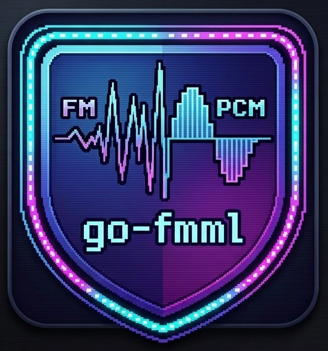

# go-fmml

🇯🇵 [日本語](README.md) ｜ 🇬🇧 English

[](https://github.com/megaak-soft/go-fmml/actions/workflows/ci.yml)
[](https://pkg.go.dev/github.com/megaak-soft/go-fmml)
[](LICENSE)
[](LICENSE-DOCS)

<p align="left">
  
</p>

An FM + PCM sound synthesis driver written in Go (Golang). It uses
[Ebitengine](https://ebitengine.org/)'s [`oto/v3`](https://github.com/ebitengine/oto) for audio
output, and is designed to be embedded as a library in a game project to play BGM written in MML
(Music Macro Language) asynchronously.
<p>
  <a href="https://megaak.com/go-fmml/docs/index.html" targer="_blabk">https://megaak.com/go-fmml/docs/index.html</a>
</p>

## Features (overview)

- An original FM synthesis core inspired by classic YAMAHA FM chips (up to 16 parts, up to
  16-voice polyphony per part)
- Operators with 8 selectable basic waveforms (W1-W8)
- PCM sound parts using WAV samples (two types: oneShot / long, up to 16 parts)
- Sequence data authored and played back in an original MML format (up to 16 FM parts + 16 PCM
  parts in sample-accurate sync)
- Master stereo reverb (Schroeder type and FDN type, with per-part send levels)
- Volume fade-in/fade-out, and a conductor part for tempo changes and loop jump points
- A bundled tool, `Smf2GoFMML`, that converts a Standard MIDI File (SMF) into this engine's MML
  format

See the documentation under [`docs/`](docs/index.html) for the full specification.

## Requirements

- **Go**: 1.24.0 or later (matches the minimum required by
  [`ebitengine/oto/v3`](https://github.com/ebitengine/oto), which go-fmml depends on)
- **Supported OS**: Windows / macOS / Linux / Android / iOS / WebAssembly (matches the platforms
  supported by `ebitengine/oto/v3`, used for audio output)

## Directory layout

```
go-fmml/
  ├── LICENSE              -- Full MIT license text (code)
  ├── LICENSE-DOCS         -- Full CC BY 4.0 license text (documentation)
  ├── README.md            -- Japanese README
  ├── README.en.md         -- This file
  ├── CONTRIBUTING.md      -- Contributing notice (Japanese & English)
  ├── CLAUDE.md            -- Development roadmap / specification
  ├── docs/                -- Specification & usage documentation (HTML)
  ├── go.mod, go.sum       -- Go module definition
  ├── fmcore/, pcmcore/, player/, fileio/, analyze/, memory/,
  │   common/, const/, reverb/  -- Source code (packages)
  ├── cmd/                 -- Demo apps for manual verification
  └── tools/               -- Bundled tool (Smf2GoFMML)
```

> **Note**: `go.mod` lives at the repository root so that module resolution works correctly for
> `go get github.com/megaak-soft/go-fmml/...`.

## Usage (overview)

### Using it as a dependency in your own Go project

```bash
go get github.com/megaak-soft/go-fmml
```

```go
import (
    "github.com/megaak-soft/go-fmml/fileio"
    "github.com/megaak-soft/go-fmml/fmcore"
    "github.com/megaak-soft/go-fmml/player"
)
```

See [`docs/en/index.html`](docs/en/index.html) for concrete code samples, including how to use it
alongside `ebitengine/oto/v3`.

### Building this repository itself

```bash
git clone https://github.com/megaak-soft/go-fmml.git
cd go-fmml
go build ./...
```

## Try the demo

A minimal working example that actually plays sound is included at
[`cmd/mmldemo`](cmd/mmldemo) (it demonstrates the full flow from loading FM voice/MML files to
playback).

```bash
cd cmd/mmldemo
go run .
```


## Contributing

Currently, this project is a personal project and does not accept Pull Requests or external
contributions. Thank you for your understanding!

See [`CONTRIBUTING.md`](CONTRIBUTING.md) for details.

## License (dual-licensed)

go-fmml uses a **dual-license** setup: the code and the documentation are licensed separately.

| Scope | License | File |
| --- | --- | --- |
| Source code (all Go source in the repository, excluding `docs/`) | MIT License | [`LICENSE`](LICENSE) |
| Documentation (this README, `CLAUDE.md`, the HTML under `docs/`, etc.) | Creative Commons Attribution 4.0 International (CC BY 4.0) | [`LICENSE-DOCS`](LICENSE-DOCS) |

- **Code (MIT)**: Can be used, modified, and redistributed almost without restriction, for
  commercial or personal projects, as long as the copyright notice and license text are retained.
- **Documentation (CC BY 4.0)**: Can be freely shared and adapted, including commercially, as
  long as appropriate credit is given to the author.

Copyright (c) 2026 MEGAAK SOFT (https://megaak.com)

This project uses [`ebitengine/oto/v3`](https://github.com/ebitengine/oto) for audio output. See
the "Third-Party Library License Notices" section of [`docs/en/license.html`](docs/en/license.html)
for oto/v3's own license.

## Other notes

This project was built with Claude Code, using a "Spec-Driven Development" approach: the engine
spec, MML spec, and phase plan were written out in detail in a specification document
(`CLAUDE.md`), and the AI implemented the code from it.

AI-generated code carries a known risk of unintentional "license contamination" - copyleft (e.g.
GPL) code patterns leaking in from the model's training data. go-fmml's specification document
defines explicit rules to avoid this kind of contamination, and the AI is required to self-check
against those rules on every code generation pass.

---
## License

  © 2026 MEGAAK SOFT (https://megaak.com) —
  This document is licensed under CC BY 4.0.
  https://creativecommons.org/licenses/by/4.0/
